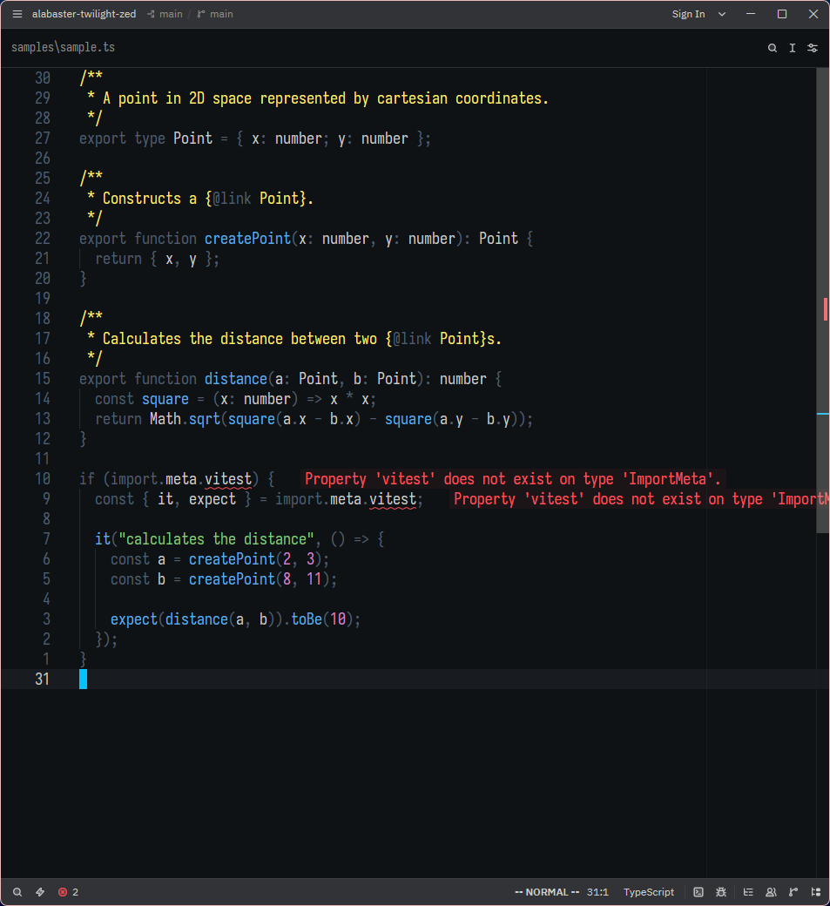
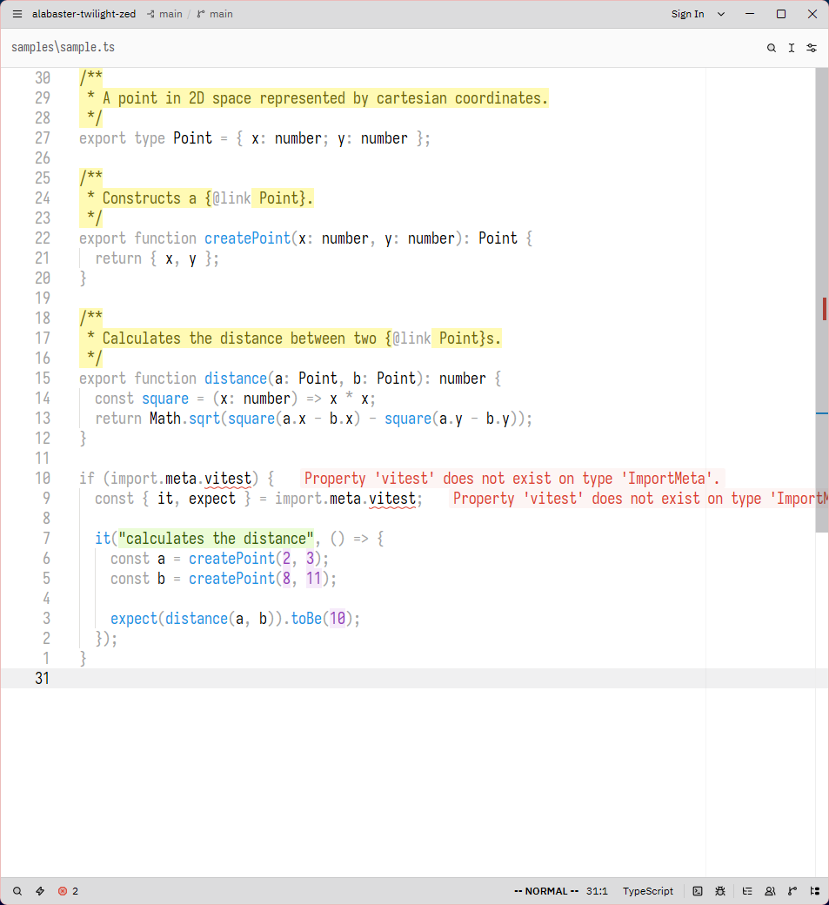

# Alabaster Twilight

A softly accented variation of [tonsky's Alabaster](https://github.com/tonsky/zed-theme-alabaster).

## Themes

### Dusk (Dark)

### Dawn (Light)

> [!NOTE]
> I would've liked to make all highlights background colors, but as it stands, some parsers don't play well with functions. In TypeScript, arrow function bodies are included in the capture, making whitespace within them blue.

## Philosophy and Differences from Alabaster

> [!NOTE]
> See [tonsky's rationale](https://tonsky.me/blog/syntax-highlighting/) for the main philosophy.

All UI element theming was taken from Alabaster. Only syntax highlighting was modified.

| Syntax                                   | Description                                                                                 | Compared to Alabaster                                                   |
| ---------------------------------------- | ------------------------------------------------------------------------------------------- | ----------------------------------------------------------------------- |
| comments                                 | **yellow** to catch attention                                                               | same                                                                    |
| functions                                | **blue** to mark delegation of control flow                                                 | Alabaster only highlights top-level declarations                        |
| plain strings                            | **green** to differentiate from other literals (especially when doing string interpolation) | same                                                                    |
| special strings (e.g., escape sequences) | **purple** same as other literals                                                           | Alabaster uses the background color to differentiate from plain strings |
| other literals                           | **purple** to distinguish constants from variables                                          | same                                                                    |
| identifiers and types                    | **normal** as I find them central to my work                                                | same                                                                    |
| others (punctiation, keywords)           | **dimmed** to accent identifiers and types                                                  | Alabaster only dims punctuation                                         |

Additionally, I made the definitions simpler to help it be more portable across editors with varying capture group support.
